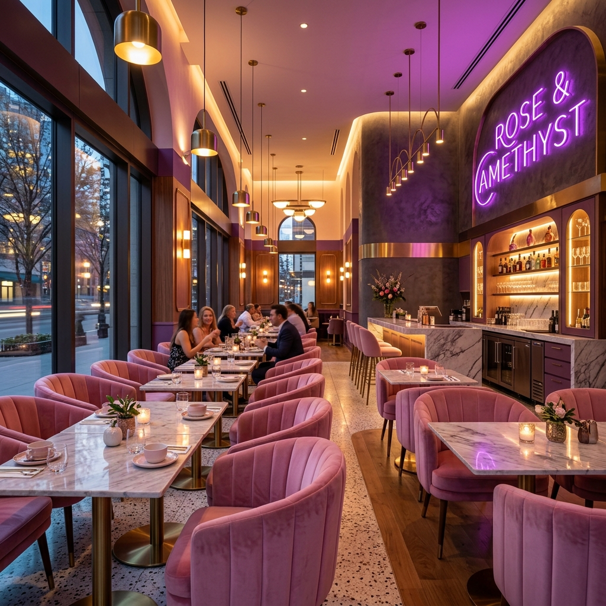

# 🍔 FoodSpot - Geolocation-Based Food Discovery & Order Aggregator

FoodSpot is a premium, full-stack MERN location-aware web application that solves the problem of fragmented food discovery. Instead of switching between maps, reviews, and delivery apps, users can explore local restaurants, cafes, and street-food stalls, check menus/prices, post reviews, and simulate deliveries in one seamless dashboard.



## 🌟 Key Features

* **📍 Geolocation Discovery & Proximity Sorting**: Calculate real-time distances from the user's GPS coordinates or simulate mock coordinates using preset location tags (MG Road, Indiranagar, Koramangala, Jayanagar) to sort eateries dynamically.
* **🗺️ Google Maps Dark-Mode Embedding**: Dynamically generates embedded Google Maps iframes based on eatery addresses, styled with custom dark overlays to fit the platform's visual identity.
* **⚡ Live Swiggy Delivery API Simulation**: Placing an order triggers a background courier dispatcher cycle that advances status in real-time (`pending` ➔ `preparing` ➔ `out-for-delivery` ➔ `delivered`) via **Socket.io** streaming.
* **🛍️ Developer Sandbox Modal**: Try out simulated Swiggy courier dispatches right from the eatery details page to test coordinate matching and delivery partner assignments.
* **🔐 Secure Authentication**: JWT-based authentication with Role-Based Access Control (RBAC) supporting Customers, Staff, and Admins.
* **🤖 FoodSpot Assistant**: Integrated chatbot to help customers find restaurants, cuisines, street food recommendations, and explain delivery redirections.
* **💖 Community Testimonials**: Verified customer feedback system and average star ratings recalculated dynamically.

## 🏗️ Architecture & Technology

### Backend (Node.js & Express)
* **Modular Service Pattern**: Clean separation of controllers, routes, models, and services.
* **MongoDB & Mongoose**: Schema-driven MERN server with full relational definitions linking Users, Eateries, MenuItems, Reviews, and Orders.
* **Real-time Engine**: Socket.io server to broadcast order progression events.
* **MongoDB Community Server 7.0.15**: Run locally via custom precompiled binaries.

### Frontend (React & Vite)
* **State Management**: React Context API for global Auth and Basket state.
* **Animations**: Framer Motion for smooth transitions and interactive micro-interactions.
* **Iconography**: Lucide React.
* **API Client**: Axios instance configured with token interceptors and base routing.

## 📁 Project Structure

```text
Cafe_web/
├── backend/            # Express API Server
│   ├── config/         # Database & environment config
│   ├── controllers/    # Business logic (auth, eateries, menus, orders, reviews)
│   ├── middleware/     # JWT Auth and error handlers
│   ├── models/         # Mongoose schemas (User, Eatery, MenuItem, Order, Review)
│   ├── routes/         # Express endpoint definitions
│   └── services/       # Socket.io emitter service
├── frontend/           # React Client (Vite)
│   ├── public/         # Static assets
│   └── src/
│       ├── api/        # Centralized Axios setup
│       ├── components/ # Reusable elements (Navbar, ChatbotWidget)
│       ├── context/    # Global context managers
│       ├── pages/      # View pages (Home, EateryDetail, Cart, OrderTracking)
│       └── App.jsx     # Route mappings & entry point
└── mongodb/            # Local MongoDB binary runtime
```

## 🚀 Getting Started

### 1. Start MongoDB Daemon
FoodSpot uses a local MongoDB instance. Run the binary from the root directory:
```bash
cd mongodb
mkdir -p data
./mongodb-linux-x86_64-ubuntu2204-7.0.15/bin/mongod --dbpath data --port 27017 --bind_ip 127.0.0.1
```

### 2. Start Backend Server
```bash
cd backend
npm install
npm run dev
```
*Note: The backend will automatically connect to MongoDB and seed 5 eateries and 15 menu items if the database is empty.*

### 3. Start Frontend Client
```bash
cd frontend
npm install
npm run dev
```
Open `http://localhost:3000` in your web browser.

## 🎨 Design System
* **Primary (Culinary Orange)**: `#ff523b`
* **Background Dark**: `#0c0d14`
* **Card Surface**: `#151622`
* **Text Primary**: `#ffffff`
* **Typography**: Outfit & Playfair Display

---
*Built with ❤️ by the FoodSpot Team.*
